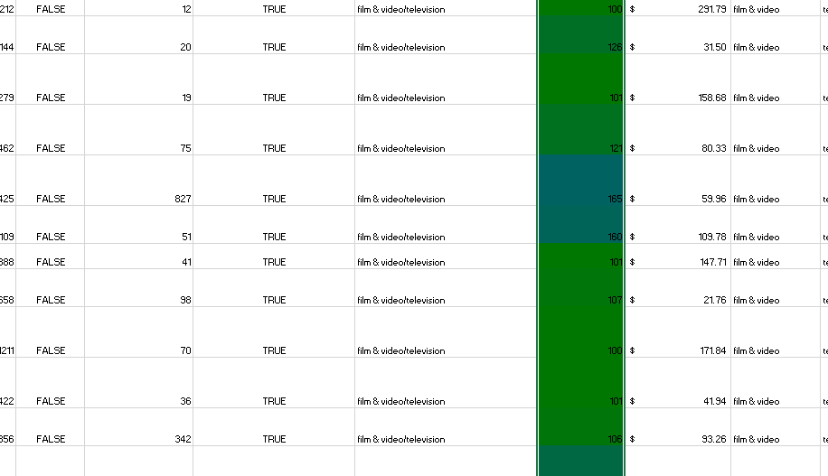
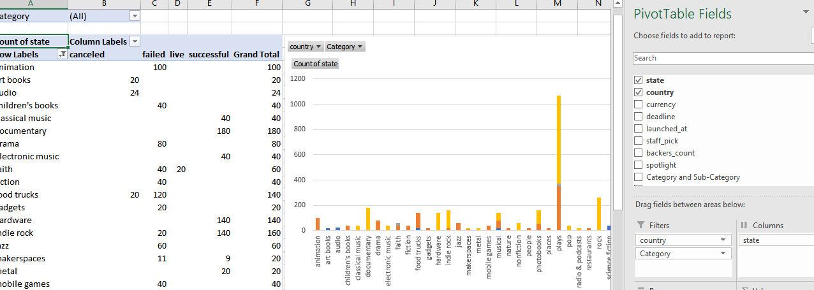
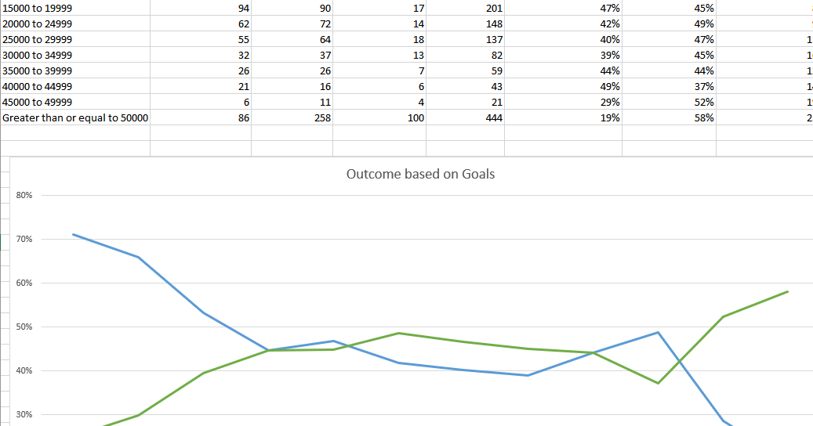

# Kickstart-my-chart
Using the data provided, modifeied and analyzed the data of 4,000 past Kickstarter projects.

Used conditional formatting to fill each cell in the state column with a different color, depending on whether the associated campaign was successful, failed, or canceled, or is currently live.

Created a new column called Percent Funded that used a formula to uncover how much money a campaign made to reach its initial goal.

Used conditional formatting to fill each cell in the Percent Funded column using a three-color scale. The scale started at 0 and is a dark shade of red, transitioning to green at 100, and blue at 200.

Created a new column called Average Donation that uses a formula to uncover how much each backer for the project paid on average.

Created two new columns, one called Category and another called Sub-Category, which used formulas to split the Category and Sub-Category column into two parts.

Created a new sheet with a pivot table that analyzed the initial worksheet to count how many campaigns were successful, failed, canceled, or are currently live per category.

Created a stacked column pivot chart that can be filtered by country based on the table.

Created a new sheet with a pivot table that analyzed initial sheet to count how many campaigns were successful, failed, or canceled, or are currently live per sub-category.

Created a stacked column pivot chart that can be filtered by country and parent-category based on the table.

Created a new column named Date Created Conversion that used formula to convert the data contained within launched_at into Excel's date format.

Created a new column named Date Ended Conversion that used formula to convert the data contained within deadline into Excel's date format.

Created a new sheet with a pivot table with a column of state, rows of Date Created Conversion, values based on the count of state, and filters based on parent category and Years.

Created a pivot chart line graph that visualizes this new table.

